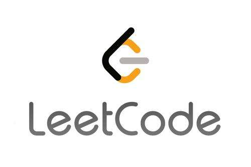
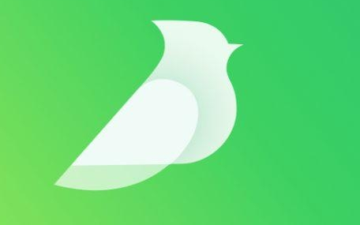

# 𝗛𝗲𝗹𝗹𝗼 𝗜'𝗺 小白 Shao

哈喽，
这里是邵小白，坐标长沙，一个励志要做脱口秀演员的前端开发

</ul>

<h3>🙌 个人知识总结</h3>
<table>
  <tr>
    <th>
      
    </th>
    <th>
      
    </th>
    <th>
      
    </th>
  </tr>
</table>
<!-- 𝑰 ❤️ 𝑭𝒓𝒐𝒏𝒕-𝒆𝒏𝒅 𝑫𝒆𝒗𝒆𝒍𝒐𝒑𝒎𝒆𝒏𝒕! 

<!-- 嘿，恭喜你发现了邵小白。一个有趣又不仅仅是有趣的前端 er！  -->

<!-- :vulcan_salute: 𝑰 𝒑𝒖𝒕 𝒎𝒐𝒔𝒕𝒍𝒚 𝒐𝒇 𝒎𝒚 𝒇𝒐𝒄𝒖𝒔 𝒐𝒏 𝒘𝒆𝒃 𝒅𝒆𝒗𝒆𝒍𝒐𝒑𝒎𝒆𝒏𝒕 𝒘𝒊𝒕𝒉 𝑱𝒂𝒗𝒂𝑺𝒄𝒓𝒊𝒑𝒕, 𝒂𝒏𝒅 𝑰'𝒎 𝒂 𝑽𝒖𝒆.𝒋𝒔 𝒏𝒆𝒓𝒅.  -->

<!-- ### 🌈 Github Stats: -->

<h3>🌈 最近正在做的事情</h3>

<table>
  <thead align="center">
    <tr>
      <th>项目</th>
      <th>简述</th>
      <th>技术</th>
      <th>成就</th>
    </tr>
  </thead>
  <tbody align="left">
    <tr>
      <th>
        <a href="https://github.com/1024shao/mini-react" target="_blank">
        mini-react</a>
      </th>
      <th> 一个简易版本的 React </th>
      <th>
        
      </th>
      <th>
        
      </th>
    </tr>
    <tr>
      <th>
        <a href="https://github.com/1024shao/emelun-admin" target="_blank">
        emulun-admin</a>
      </th>
      <th> 基于 Vite 实现的 MVP 组件库 </th>
      <th>
        
      </th>
      <th>
        
      </th>
    </tr>
    <tr>
      <th>
        <a href="https://github.com/1024shao/mini-rollup" target="_blank">
        mini-rollup</a>
      </th>
      <th> 打造属于自己的 packetizer  </th>
      <th>
        
      </th>
      <th>
        
      </th>
    </tr>

  </tbody>
</table>

### ❤️‍🔥 GayHub starts

